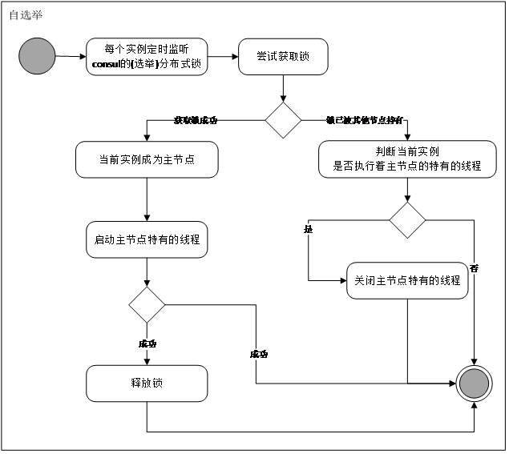

分布式主从-Consul
=
## 目录

 * <a href="#1">介绍</a>
 * <a href="#2">使用指南</a>
 
 * * *
 
 ### <a name="1">介绍</a>
 
 hummer-cluster是基于Consul的KV存储分布式选举原理引用Spring AOP技术和Spring event实现的分布式主从选举框架.最终以jar包的方式提供使用.
 
#### 总体设计


#### 主要功能

 * 支持主从选举
    
 > <a id="1-1">选举流程</a>
 ```
     1.节点启动完成之后会首先参与选举一次,如果当前节点选举成功,则作为主节点存在,并发布一个选举结果事件
     
     2.如果选举不成功,则当前节点会基于consul KV存储的阻塞查询,监听KV的当前状态,如果KV发生变更,会触发所有节点的重新选举的流程
     
     3.选举结果的处理需要依赖了改jar包去实现ElectEventListener来做相应的业务逻辑处理
 ```
 
 * 提供基于AOP注解的判断当前节点是否是主节点实现方式
 
  ```
      1.主要作用让从节点不做和主节点重复的事情
  ```
 
 #### 依赖中间件
 
 * redis
 * consul
 
 ### <a name="2">使用指南</a>
 
 #### 依赖引用(hummer-cluster)
 
  ```
       <dependency>
           <groupId>org.enast.hummer</groupId>
           <artifactId>hummer-cluster</artifactId>
           <version>1.0.0-SNAPSHOT</version>
       </dependency>
  ```
 
 #### 选举开启方式
  
  ```
      需要主动调用jar包中的ConsulElectServiceImpl的work()方法开启选举
   
  ```
 
 #### 选举结果事件处理--使用举例(参考hummer-demo)
 
 ```
    cluster.eventlistener.ElectEventListener     
 ```
 
  
 #### 判断当前节点是否是主节点
 
 ```
    @ClusterMaster 注解式注解到对应的方法即可.
    被改注解的方法,如果当前节点不是主节点,方法体的业务逻辑代码不会被执行
 ```
 
 #### 基于选举实现初始化任务不被重复执行--使用举例(参考hummer-demo)
  
  ```
     jar包中的ConsulElectServiceImpl的work()是选举启动的必须调用的方法
     该方法会返回一次选举结果,因此节点实例可以在初始化相关的代码执行之前先拿到这个结果,判断是否选举成功,成功即可执行初始化相关的代码.
  ```

  
  
 