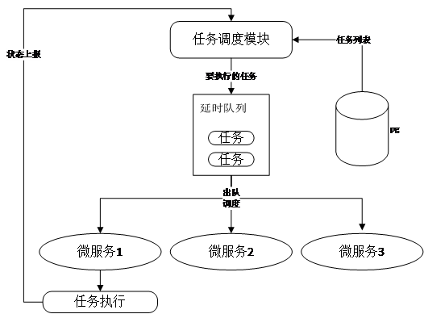
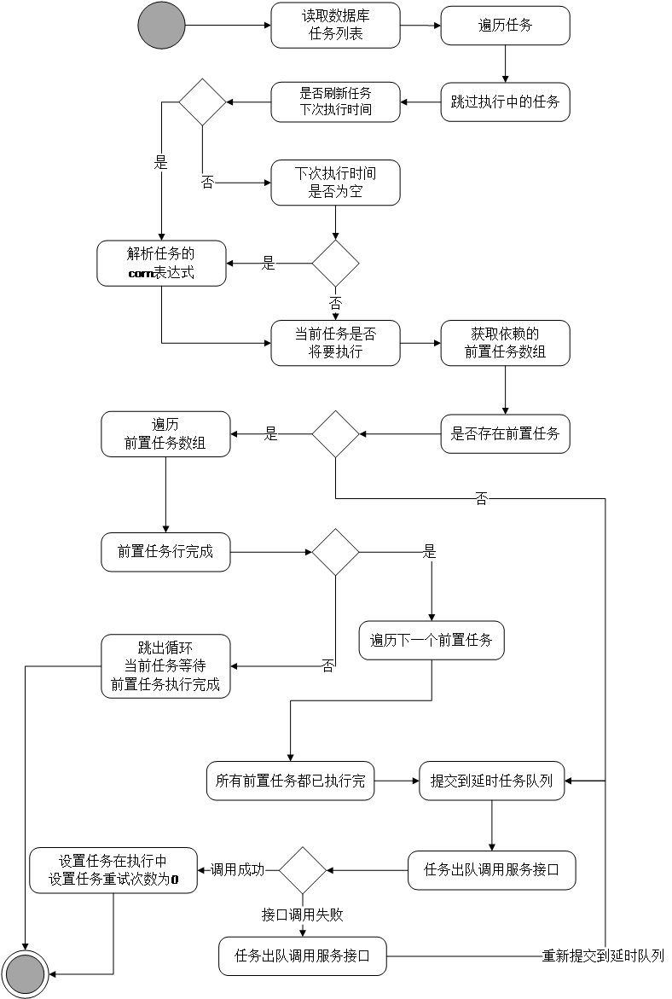
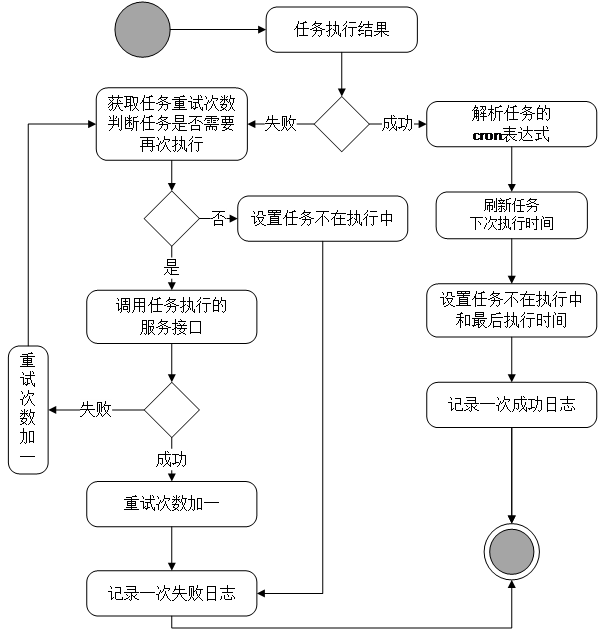

分布式任务统一调度
=


## 目录

 * <a href="#1">介绍</a>
 * <a href="#2">使用指南</a>
 
 * * *
 
 ### <a name="1">介绍</a>
 
hummer-task是为了解决分布式多实例情形下任务调度的一致性(统一调度)问题基于Spring AOP和redisson分布式框架而实现的分布式任务调度框架.最终以jar包的方式提供使用.
 
#### 总体设计


##### 任务调度流程


##### 任务执行结果处理


#### 主要功能

 * 支持任务主动发现并初始化
    
 > <a id="1-1">主要流程</a>
 ```
     节点实例启动的时框架会去主动发现当前实例的注解说要需要框架的管理的任务,并走批量restful接口调用任务注册节点,实现任务的主动注册
     如果任务之前已经注册过(即数据库中的任务表存在该任务),那么此任务会被忽略,因为该功能只负责任务的初始化,不会做任务的更新,确保了任务相关信息的可控性.
 ```
 
 * 支持任务统一调度
 
 > <a id="1-1">主要流程</a>
 
  ```
    主要流程是由主节点周期性去数据库中获取需要执行的任务,然后异步调用框架中封装好的统一接口,并且这个接口是每个依赖了当前框架的节点实现都会有实现；
    任务执行完之后会调用框架中封装好的接口上报任务执行状态给任务服务端，又服务端做任务的状态信息更新处理。
  ```
 
 * 支持分布式部署情形下任务的一致性控制(分布式锁)
     
  > <a id="1-1">说明</a>
  ```
      对于定时任务执行周期少了3分钟的任务并且是使用了@Scheduled注解的定时任务，当前框架是不适合进行统一管理的，但是当前框架提供这些任务的一致性调用的控制功能。所谓一致性调用就是，保证多实例情况下，任务不被重复执行。
      底层基于redission实现
  ```
  
 #### 依赖中间件
 
 * redis
 
 #### 依赖框架
  
 * redisson
  
 ### <a name="2">使用指南</a>
 
 #### 依赖引用(参考hummer-task)
 
  ```xml
       <dependency>
           <groupId>org.enast.hummer</groupId>
           <artifactId>hummer-unifyTask</artifactId>
           <version>1.0.0-SNAPSHOT</version>
       </dependency>
  ```
 
 #### 注解式声明需要管理的任务
  
  ```
    主要是在对应的任务实现的java类中注解@EnableUnifyTask和在对应的方法中声明注解@UnifyTask(taskNo = "test", cron = ""),即可。
    说明：taskNo是任务的唯一标识,cron是任务执行的cron表达式。
    参考样例:jar包中,TestServiceImpl
  ```
 
 #### 注解式声明分布式部署情形下任务的一致性控制(分布式任务锁)
 
 ```
    1.需要开启配置:hummer.redisson.use=true
    2.在任务入口方法上注解@DistributedJoLock(lockKeyPre="",lockKey="taskId")
        lockKeyPre:锁的key前缀
        lockKey:锁的key,对应任务id,确保唯一
 ```
 
 
 #### 任务修改
  
  ```
    客户端可以在代码层面,根据自身业务修改任务的name和cron
    
    如:
    1.注入
    @Resource
    ClientUnifyTaskService clientUnifyTaskService
    2.调用
    TaskAjaxResult<Boolean> tasksUpdate(List<UnifyTaskUpdate> tasks) 即可.
    
  ```
  
   
 #### 任务查询
  
  ```
    客户端可以在代码层面,根据自身业务修改任务的name和cron
    
    如:
    1.注入
    @Resource
    ClientUnifyTaskService clientUnifyTaskService
    2.调用
    TaskAjaxResult<Boolean> taskByNo(String taskNo) 即可.
    
  ```