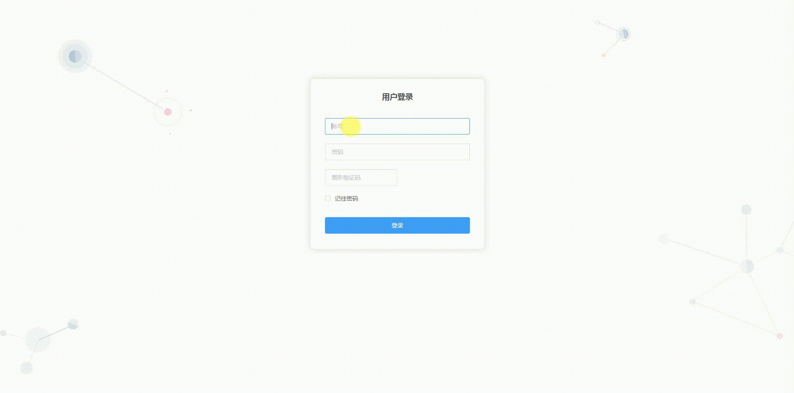

# vue搭建后台管理界面模版（PC端）
------------------------




#### 技术栈
vue2 + vuex + vue-router + webpack + ES6/7 + axios + elementUI + 阿里图标iconfont

#### 项目预览
[http://nmgwap.gitee.io/vueproject/#/login](http://nmgwap.gitee.io/vueproject/#/login)


#### 说明

>  本项目主要用于熟悉如何用 vue2 架构一个后端管理平台项目

>  为了方便后期修改使用，模拟数据在页面中，具体修改看下面【强调】

>  如果对您有帮助，您可以点右上角 "Star" 支持一下 谢谢！ ^_^

>  或者您可以 "follow" 一下，我会不断开源更多的有趣的项目

>  开发环境 w7  Chrome 61

>  如有问题请直接在 Issues 中提，或者您发现问题并有非常好的解决方案，欢迎 PR 👍


#### 运行项目
------------------------

``` bash
# install dependencies
npm install

# serve with hot reload at localhost:8080
npm run dev

# build for production with minification
npm run build

# build for production and view the bundle analyzer report
npm run build --report

# run unit tests
npm run unit

# run e2e tests
npm run e2e

# run all tests
npm test


```

#### 项目源码地址：
------------------------

码云地址：https://gitee.com/ldhblog/vue-element.git
github地址：https://github.com/nmgwap/vue-ManagementPlatform.git


